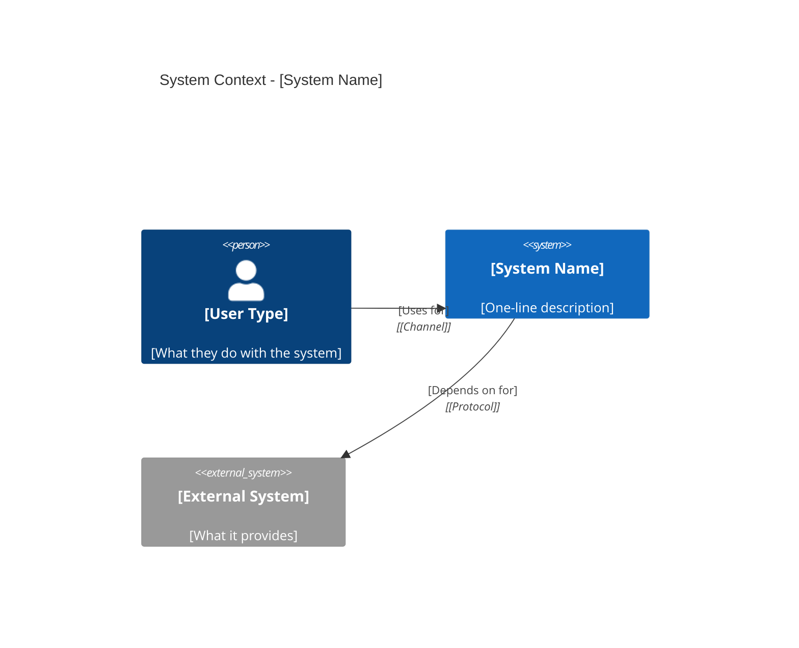
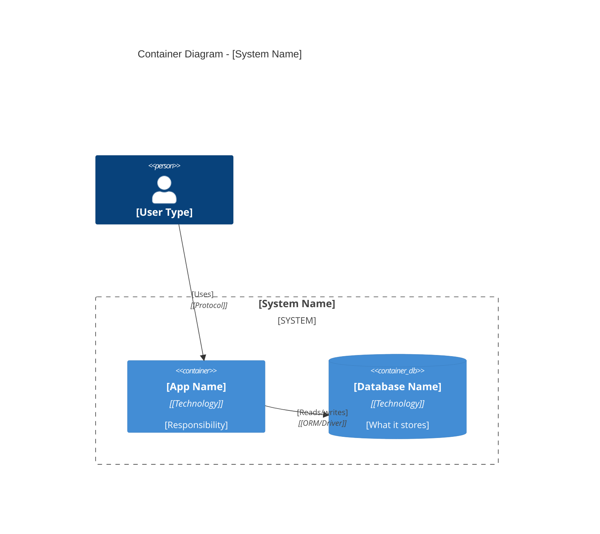
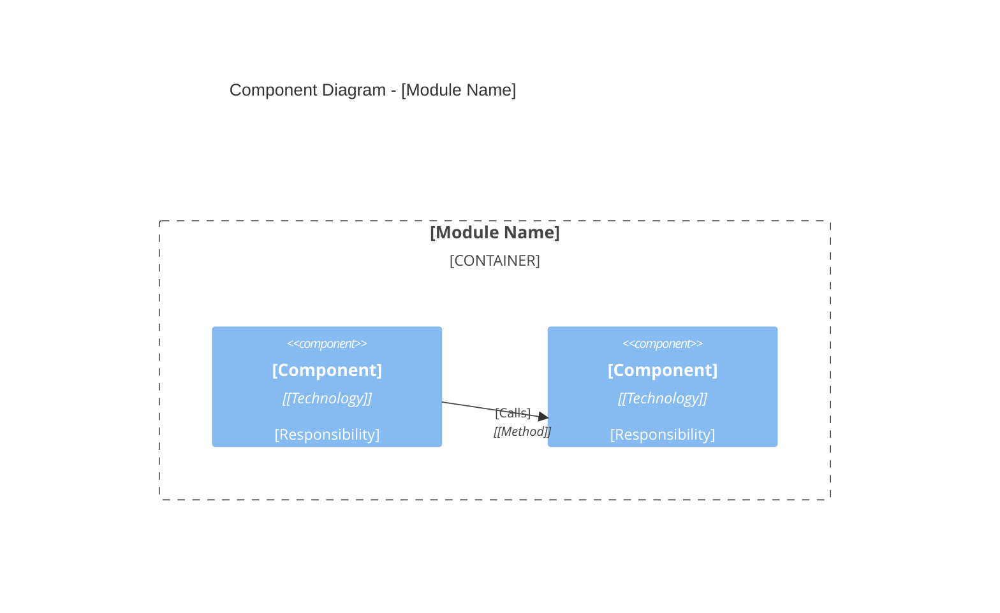
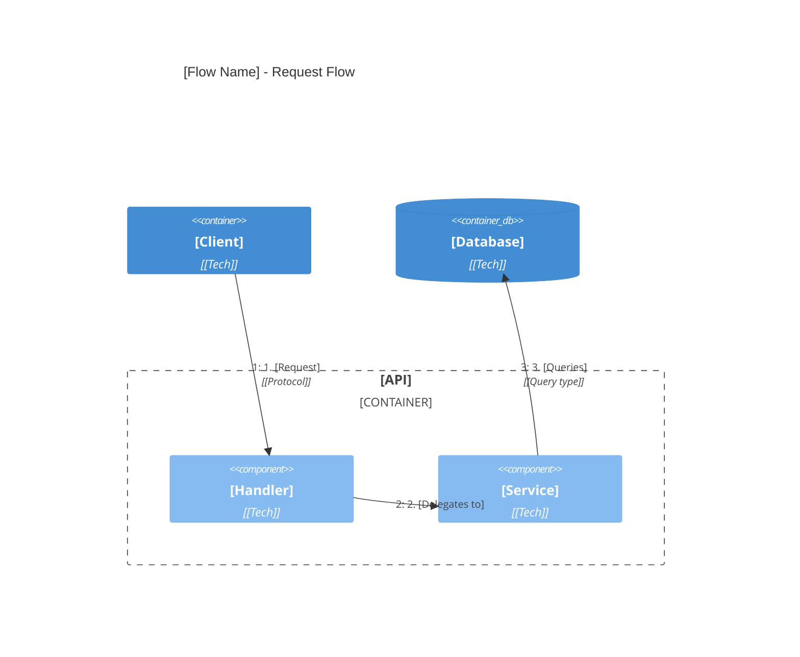

# Diagram Protocol

Which C4 diagram at which depth level, and how to generate them in Mermaid.

---

## Diagram Per Depth Level

| Depth | Diagram | Why |
|-------|---------|-----|
| **TL;DR** | None | Speed over visualization. Text-only. |
| **Report** | C4 Context + Container | Shows system in context + internal boundaries. Sufficient for most understanding. |
| **Deep Dive** | C4 Component + Dynamic | Shows internal wiring of one module + request flows through it. |

Do not generate diagrams the user didn't ask for. Do not generate deployment diagrams unless the user specifically asks about infrastructure.

---

## C4 Context Diagram (Report Level)

Shows the system and its external actors. Always generate this first.

### What to include
- The system as a single box
- External people who use it
- External systems it depends on
- Key relationships with labels

### Mermaid template



### Rules
- One system box only. Context diagrams are deliberately zoomed-out.
- Every relationship needs a label and a technology/protocol.
- If the system has more than 3 user types, group them.

---

## C4 Container Diagram (Report Level)

Shows the internal containers (apps, services, databases) within the system.

### What to include
- Each deployable unit as a Container
- Databases as ContainerDb
- Message queues as ContainerQueue
- Grouped inside System_Boundary
- Data flows between containers

### Mermaid template



### Rules
- Container = something that can be deployed independently
- Every container needs: name, technology, responsibility
- Group related containers inside Container_Boundary
- Show data flow direction with Rel_D / Rel_U / Rel_L / Rel_R for readability

---

## C4 Component Diagram (Deep Dive Level)

Shows the internal components of a single container. Generated only during Deep Dive.

### What to include
- Major classes/modules/composables within the target container
- Their relationships and data flow
- External dependencies

### Mermaid template



### Rules
- Only diagram the module the user is deep-diving
- Component = a meaningful unit of work (service, handler, repository, composable)
- Omit trivial components (DTOs, config objects) unless they carry architectural meaning

---

## C4 Dynamic Diagram (Deep Dive Level)

Shows a numbered sequence of interactions. Use for complex request flows.

### Mermaid template



### Rules
- Number every step in the flow
- One diagram per request flow
- Keep under 10 steps; if longer, split into sub-flows

---

## Layout and Styling

### Fix overlapping labels
```
UpdateRelStyle(from, to, $offsetX="5", $offsetY="-10")
```

### Fix layout density
```
UpdateLayoutConfig($c4ShapeInRow="3", $c4BoundaryInRow="1")
```

### Highlight specific elements
```
UpdateElementStyle(alias, $fontColor="red", $bgColor="grey", $borderColor="red")
```

---

## Quality Checklist

Before including any diagram in output:

- [ ] Every element has: Name, Type, Technology (where applicable), Description
- [ ] Every relationship has: Label and Technology/Protocol
- [ ] Diagram fits on one screen (not a wall of boxes)
- [ ] No orphan elements (everything connects to something)
- [ ] Title describes what the diagram shows
